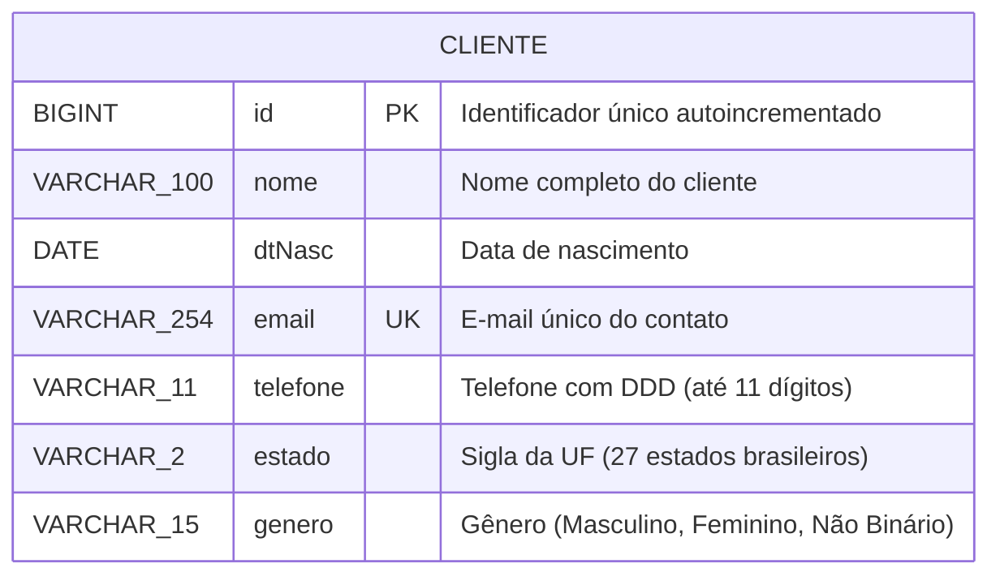
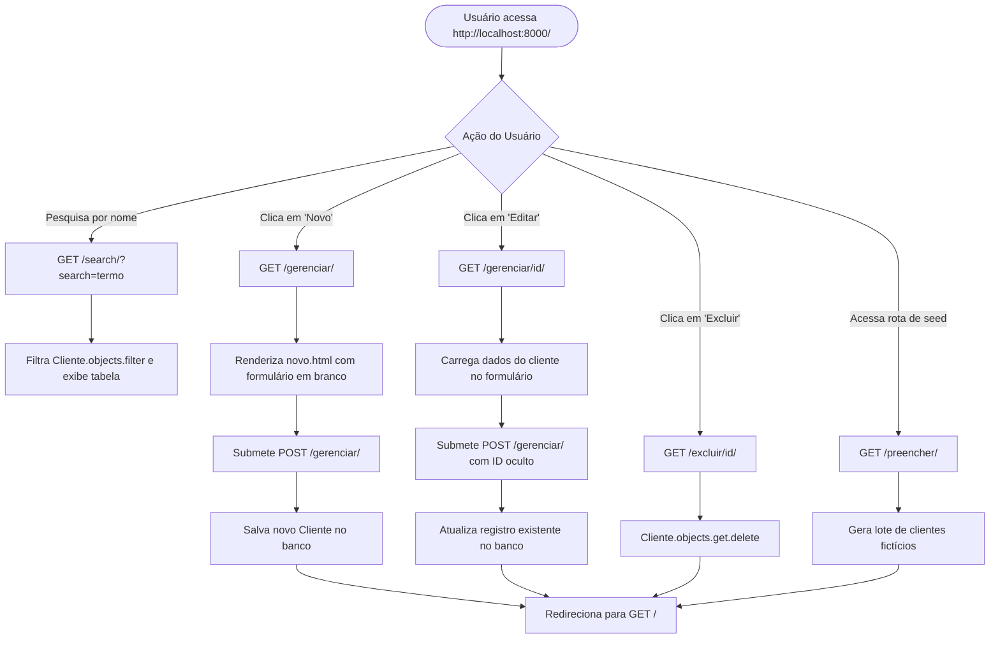

# 📇 Agenda Python — Sistema Web de Gestão de Clientes em Django

<br />

<div align="center">

[](https://www.python.org/)
[](https://www.djangoproject.com/)
[](https://www.sqlite.org/)
[](https://www.postgresql.org/)
[](https://getbootstrap.com/)
[](LICENSE)
[](#)
[](#)

</div>

---

## 🔗 Acesso e Execução

A aplicação é executada como um servidor web full-stack local através do utilitário `manage.py` do Django. Após a inicialização, o sistema fica disponível nos seguintes endereços:

* **Painel de Gestão de Clientes:** `http://localhost:8000/`
* **Painel Administrativo do Django:** `http://localhost:8000/admin/`
* **Formulário de Novo Cliente:** `http://localhost:8000/gerenciar/`
* **Popular Base com Dados Fictícios:** `http://localhost:8000/preencher/`

---

## 📖 Visão Geral

A **Agenda Python** é uma aplicação web full-stack desenvolvida originalmente como projeto avaliativo do curso de desenvolvimento web com Python da **Faculdade Senac**.

O propósito central do projeto é fornecer uma solução ágil e intuitiva para o gerenciamento de contatos e clientes, permitindo que operadores cadastrem, consultem, pesquisem, editem e excluam registros através de uma interface web responsiva e elegante.

Construída sobre o framework **Django 5.0.3**, a aplicação adota o padrão de arquitetura **MVT (Model-View-Template)**, integrando o Django ORM com um banco de dados relacional e renderizando interfaces estilizadas com **Bootstrap 5.3.3** em conjunto com efeitos visuais customizados de **Glassmorphism**.

---

## ✨ Funcionalidades

* **Listagem Geral de Clientes (`GET /`):**
  * Visualização consolidada de todos os clientes em tabela Bootstrap responsiva com paginação natural, apresentando Nome, Data de Nascimento formatada (`dd Mmm aaaa`), Gênero, E-mail, Telefone, Estado (UF) e botões de ação rápida.
  * Mensagem informativa de estado vazio (*"Nenhum Cliente Cadastrado"*) caso a base de dados não possua registros.
* **Busca Dinâmica por Nome (`GET /search/`):**
  * Mecanismo de busca textual integrado que filtra registros em tempo real utilizando operadores de correspondência insensíveis a maiúsculas/minúsculas (`__icontains`).
* **Cadastro Completo de Cliente (`GET / POST /gerenciar/`):**
  * Formulário completo com validação de campos obrigatórios.
  * Seleção padronizada de todos os 27 estados e unidades federativas brasileiras (UFs).
  * Seleção padronizada de identidade de gênero (Masculino, Feminino e Não Binário).
* **Edição de Registros Existentes (`GET /gerenciar/<int:id>/`):**
  * Carregamento prévio dos dados do cliente selecionado no formulário para alterações e regravação segura no banco de dados.
* **Exclusão de Clientes (`GET /excluir/<int:id>`):**
  * Remoção do registro no banco com redirecionamento automático para a tabela inicial.
* **Seed / Mock de Dados Automático (`GET /preencher/`):**
  * Rota utilitária de desenvolvimento que insere instantaneamente uma lista de registros fictícios diversificados de clientes com nomes, e-mails, telefones, datas de nascimento e estados do Brasil.
* **Painel Administrativo do Django (`/admin/`):**
  * Interface administrativa nativa do Django registrada para gerenciamento de superusuários e auditoria de modelos.

---

## 🎯 Diferenciais e Destaques Técnicos

1. **Arquitetura MVT (Model-View-Template) com Django:** Separação clara de responsabilidades entre o modelo de dados (`models.py`), regras de controle e visualização (`views.py`) e apresentação dinâmica (`templates/pages/` e `templates/partials/`).
2. **Formulários Estruturados com Django Forms (`MeuFormulario`):** Utilização do módulo `django.forms` para desacoplamento de escolhas de campos de seleção (`ChoiceField`), injetando classes semânticas do Bootstrap (`form-select`) diretamente nos atributos dos widgets HTML.
3. **Design com Glassmorphism e Dark Mode Nativo:**
   * O template mestre `base.html` adota o atributo `data-bs-theme="dark"` do Bootstrap 5.3.3.
   * O formulário em `novo.html` é envolvido em um card estilizado com a classe customizada `.glass`, aplicando desfoque de fundo (*backdrop-filter* de 4.6px), transparência calculada (`rgba(116, 113, 113, 0.87)`) e bordas translúcidas sutis.
4. **Segurança Web Nativa:**
   * **Proteção contra CSRF:** Formulários POST utilizam a tag `` para impedir ataques do tipo Cross-Site Request Forgery.
   * **Integridade de E-mail:** O campo `email` no model `Cliente` possui restrição de unicidade (`unique=True`), impedindo duplicações cadastrais na base de dados.
   * **Prevenção de Duplo Envio (Double Submit):** Inclusão de script defensivo que desabilita o botão de submissão (`disabled=true`) assim que o formulário é enviado pelo usuário.
5. **Configuração de Internacionalização:** Configuração do Django no fuso e idioma brasileiro (`LANGUAGE_CODE = 'pt-br'`, `USE_I18N = True`, `USE_TZ = True`).

---

## 🏗️ Arquitetura e Estrutura de Pastas

```bash
agenda_python/
├── .gitignore                                 # Regras de exclusão do Git (ambientes virtuais, SQLite, logs)
├── manage.py                                  # Utilitário de linha de comando para gerenciamento do Django
├── README.MD                                  # Documentação técnica do projeto
├── cadcli/                                    # Módulo central de configuração do projeto Django
│   ├── __init__.py
│   ├── asgi.py                                # Ponto de entrada ASGI para servidores assíncronos
│   ├── settings.py                            # Configurações globais (Apps, Middlewares, Banco de Dados, I18N)
│   ├── urls.py                                # Roteamento global de URLs (Admin e inclusão do app Home)
│   └── wsgi.py                                # Ponto de entrada WSGI para servidores web tradicionais
└── home/                                      # Aplicação principal de gerenciamento de clientes
    ├── __init__.py
    ├── admin.py                               # Registro do modelo Cliente no Django Admin
    ├── apps.py                                # Metadados de configuração da aplicação Home
    ├── models.py                              # Modelo Cliente com validações e choices (UFs e Gêneros)
    ├── tests.py                               # Arquivo base para testes automatizados
    ├── urls.py                                # Mapeamento de rotas locais da aplicação
    ├── views.py                               # Controladores (index, search, handle_form, delete_one, preencher)
    ├── forms/
    │   └── form.py                            # Formulário MeuFormulario com widgets estilizados do Bootstrap
    ├── migrations/
    │   └── 0001_initial.py                    # Migração inicial gerada pelo Django para criação da tabela
    ├── static/
    │   └── css/
    │       └── style.css                      # Estilos personalizados e efeito Glassmorphism (.glass)
    └── templates/
        ├── pages/
        │   ├── index.html                     # Tabela de listagem e barra de pesquisa por nome
        │   └── novo.html                      # Formulário de criação e edição com Glassmorphism
        └── partials/
            ├── base.html                      # Template mestre com Bootstrap 5.3.3 e tema Dark
            └── menu.html                      # Barra de navegação superior (Navbar)
```

---

## 📊 Modelagem de Dados

### Diagrama Entidade-Relacionamento (DER)

A entidade `Cliente` armazena os dados cadastrais essenciais e suas restrições estruturais:



---

## 🔄 Fluxo de Navegação e Casos de Uso



---

## 📋 Tabela de Rotas e Endpoints

| Método | Rota | View Associada | Descrição da Operação |
| :---: | :--- | :--- | :--- |
| `GET` | `/` | `home.views.index` | Renderiza a tabela principal com todos os clientes cadastrados. |
| `GET` | `/search/` | `home.views.search` | Filtra clientes através do parâmetro `?search=<nome>`. |
| `GET` | `/gerenciar/` | `home.views.handle_form` | Apresenta o formulário em branco para inclusão de novo cliente. |
| `GET` | `/gerenciar/<id>/` | `home.views.handle_form` | Apresenta o formulário preenchido com os dados do cliente correspondente. |
| `POST` | `/gerenciar/` | `home.views.handle_form` | Processa a criação ou atualização do registro do cliente no banco. |
| `GET` | `/excluir/<id>` | `home.views.delete_one` | Remove o cliente identificado pelo ID e redireciona para `/`. |
| `GET` | `/preencher/` | `home.views.gerarDadosFicticios` | Popula o banco com clientes de demonstração para testes rápidos. |
| `*` | `/admin/` | `django.contrib.admin` | Painel administrativo do Django para gerenciamento e autenticação. |

---

## 🎨 UX, Animações e Interfaces

* **Tema Escuro Nativo (Bootstrap 5.3.3):** A interface utiliza `data-bs-theme="dark"`, proporcionando conforto visual e estética contemporânea.
* **Efeito Glassmorphism (`.glass`):**
  ```css
  .glass {
    background: rgba(116, 113, 113, 0.87);
    border-radius: 16px;
    box-shadow: 0 4px 30px rgba(0, 0, 0, 0.1);
    backdrop-filter: blur(4.6px);
    -webkit-backdrop-filter: blur(4.6px);
    border: 1px solid rgba(255, 255, 255, 0.96);
  }
  ```
* **Feedback e Prevenção de Erros de Submissão:** Script leve em JavaScript nativo escuta o evento `submit` do formulário e desabilita imediatamente o botão `#submit`, evitando múltiplos cadastros acidentais gerados por cliques repetidos.

---

## 🎓 Objetivo do Projeto

Desenvolvido para consolidar competências práticas no curso de extensão da **Faculdade Senac**, o projeto explora:
* Criação de projetos e aplicações modulares em **Python com Django**.
* Manipulação do Django ORM com operações CRUD completas.
* Validação e renderização com Django Forms.
* Integração de templates com componentes modernos do Bootstrap 5.

---

## ⚙️ Requisitos e Instalação

### Pré-requisitos
* **Python:** Versão `3.12.x` (ou superior).
* **Gerenciador de Pacotes:** `pip` e ambiente virtual `venv`.
* **Banco de Dados:** SQLite (padrão nativo do Django) ou PostgreSQL 12+.

### Passo a Passo de Instalação

1. Clone o repositório em sua máquina:
```bash
git clone https://github.com/erickystn/agenda_python.git
```

2. Acesse a pasta do projeto:
```bash
cd agenda_python
```

3. Crie e ative um ambiente virtual isolado:
```bash
# Linux / macOS
python3 -m venv venv
source venv/bin/activate

# Windows
python -m venv venv
.\venv\Scripts\activate
```

4. Instale o Django e as dependências necessárias:
```bash
pip install django
```

5. Execute as migrações para criar as tabelas no banco de dados SQLite:
```bash
python manage.py migrate
```

6. (Opcional) Crie um superusuário para acessar o painel administrativo do Django:
```bash
python manage.py createsuperuser
```

---

## 🚀 Como Executar

1. Inicie o servidor embutido do Django:
```bash
python manage.py runserver
```

2. Abra o navegador e acesse:
```text
http://localhost:8000/
```

3. *(Opcional)* Para popular o banco rapidamente com dados de teste, acesse no navegador:
```text
http://localhost:8000/preencher/
```

---

## 💻 Exemplos de Uso e Código

### 1. Modelo de Dados com Choices Nativas (`home/models.py`)
```python
from django.db import models

class Cliente(models.Model):
    GENEROS = (
        ('masculino', 'Masculino'),
        ('feminino', 'Feminino'),
        ('nao_binario', 'Não Binário'),
    )

    nome = models.CharField(max_length=100)
    dtNasc = models.DateField()
    email = models.EmailField(max_length=254, unique=True)
    telefone = models.CharField(max_length=11)
    estado = models.CharField(max_length=2, choices=ESTADOS_BRASILEIROS)
    genero = models.CharField(max_length=15, choices=GENEROS)

    def __str__(self) -> str:
        return self.nome
```

---

### 2. Busca Otimizada com Filtro Case-Insensitive (`home/views.py`)
```python
def search(request):
    busca = request.GET.get('search', '')
    clientes = Cliente.objects.filter(nome__icontains=busca)
    return render(request, 'pages/index.html', {'clientes': clientes})
```

---

## 🧪 Suíte de Testes

O projeto conta com o módulo `home/tests.py` integrado ao executor de testes do Django.

Para executar os testes:
```bash
python manage.py test
```

---

## 🛠️ Tecnologias Utilizadas

| Tecnologia | Versão | Papel na Aplicação |
| :--- | :--- | :--- |
| **[Python](https://www.python.org/)** | `3.12.x` | Linguagem de programação principal utilizada no backend. |
| **[Django](https://www.djangoproject.com/)** | `5.0.3` | Framework web full-stack de alto nível para desenvolvimento ágil e seguro. |
| **[SQLite](https://www.sqlite.org/)** | 3 | Banco de dados relacional embarcado padrão utilizado em ambiente de desenvolvimento. |
| **[Bootstrap](https://getbootstrap.com/)** | `5.3.3` | Framework de front-end para responsividade, tabelas, formulários e tema escuro. |
| **[HTML5 / CSS3](https://developer.mozilla.org/pt-BR/docs/Web/HTML)** | — | Estruturação semântica e customizações visuais com Glassmorphism. |

---

## 📈 Melhorias e Próximos Passos (Roadmap)

- [ ] **Geração de Arquivo `requirements.txt`:** Formalizar a lista de dependências exatas com `pip freeze > requirements.txt`.
- [ ] **Validação e Máscara de Telefone:** Adicionar validação de número de dígitos e máscara interativa via JavaScript (ex: `(XX) XXXXX-XXXX`).
- [ ] **Paginação com `Paginator` do Django:** Implementar paginação para dividir a exibição caso a base possua dezenas ou centenas de registros.
- [ ] **Mensagens Flash (Django Messages):** Adicionar alertas de sucesso (*"Cliente cadastrado com sucesso!"*) após operações de criação e exclusão.
- [ ] **Exclusão Segura via POST / Modal de Confirmação:** Substituir a exclusão via rota `GET /excluir/<id>` por requisição com confirmação e token CSRF para evitar exclusões acidentais.

---

## 🤝 Como Contribuir

1. Faça um **Fork** do repositório.
2. Crie uma branch para sua melhoria:
   ```bash
   git checkout -b feature/minha-feature
   ```
3. Realize seus commits seguindo boas práticas semânticas:
   ```bash
   git commit -m "feat: adiciona paginacao com Django Paginator na listagem de clientes"
   ```
4. Envie suas alterações para o repositório remoto:
   ```bash
   git push origin feature/minha-feature
   ```
5. Abra um **Pull Request** detalhando as melhorias implementadas.

---

## 👤 Autor & Créditos

* **Desenvolvedor:** [Ericky Sant'ana](https://github.com/erickystn)
* **Instituição de Ensino:** Projeto acadêmico desenvolvido durante o curso de desenvolvimento Web com Python na **Faculdade Senac**.

---

## 📄 Licença

Este projeto está disponível sob a licença **MIT**. Para maiores informações sobre termos e condições de uso, consulte o arquivo de licença ou sinta-se à vontade para estudar, clonar e aprimorar a implementação.
